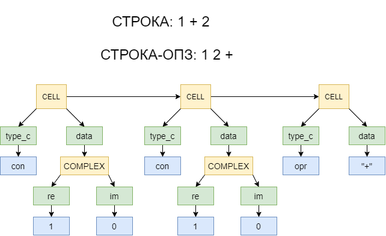
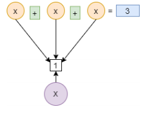

# RPN_calculator
(Free Pascal)
Простой калькулято на основе Обратной Польской Записи (ОПЗ/RPN), способный считать значения выражений с **комплексными числами**.
Маленькое ограничение: между всеми токенами надо ставить пробелы (комплексное число может считаться за один токен):
  * Приемлимое выражение: 4+2i * ( 2-1i + 3 )
  * Неприемлимое выражение: 4+2\*3

Определения:
  * [Что такое ОПЗ](https://ru.wikipedia.org/wiki/%D0%9E%D0%B1%D1%80%D0%B0%D1%82%D0%BD%D0%B0%D1%8F_%D0%BF%D0%BE%D0%BB%D1%8C%D1%81%D0%BA%D0%B0%D1%8F_%D0%B7%D0%B0%D0%BF%D0%B8%D1%81%D1%8C)

Код можно разбить на 5 основных частей:
  1. Определения констант и типов данных, разъяснения;
  2. Определение операций над базовыми структурами (стек, список, узлы);
  3. Преобразование строки обычного выражения в строку, записанную по правилам ОПЗ;
  4. Преобразование строки, записанной по ОПЗ в "вычисляемое выражение" (ВВ);
  5. Вычисление ВВ.

Преобразование строки в строку-ОПЗ происходит ровно по тем правилам, что написаны в определении ОПЗ.
После преобразования строки-ОПЗ в ВВ оно выглядит следующим образом:

Последующая задача программы лишь состоит в том, чтобы пройти по всему списку от начала до конца, и обработать каждую в соответствие с её типом. Все промежуточные результаты сохраняются в отдельный список, т.к. еще необходимы на этапе расчетов, но по окончании сразу удаляются.

Переменные для удобства изменения значения хранятся следующим образом:

